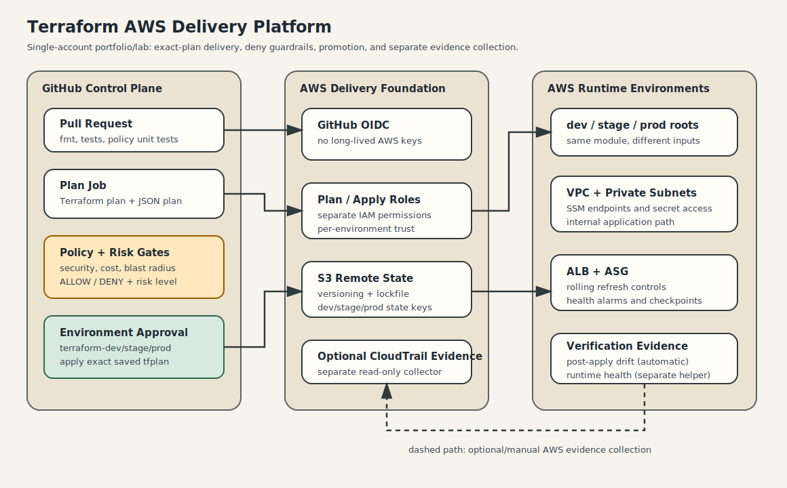

# Terraform AWS Delivery Platform

[](https://github.com/VlrRbn/terraform-aws-delivery-platform/actions/workflows/pr-checks.yml)
[](https://github.com/VlrRbn/terraform-aws-delivery-platform/actions/workflows/terraform-quality-gates.yml)
[](https://github.com/VlrRbn/terraform-aws-delivery-platform/actions/workflows/drift-check.yml)

Production-style Terraform delivery pipeline for AWS infrastructure.

This repository demonstrates how to move Terraform changes through review, policy checks, risk classification, approval, exact-plan apply, drift detection, incident runbooks, and CloudTrail-backed audit evidence.

## What This Project Shows

- Multi-environment Terraform delivery: `dev`, `stage`, `prod`
- Remote state in S3 with lockfile-based locking
- GitHub Actions OIDC to AWS
- Separate plan and apply roles per environment
- Least-privilege IAM for Terraform plan/apply
- Policy-as-code checks over Terraform JSON plans
- Cost and blast-radius guardrails
- Apply risk classification
- GitHub Environment approval before apply
- Exact reviewed binary plan apply
- Post-apply drift check
- Incident and state recovery runbooks
- CloudTrail audit evidence collection
- Redacted portfolio evidence templates

## Repository Structure

```text
.
├── .github/workflows/
│   ├── pr-checks.yml
│   ├── drift-check.yml
│   ├── terraform-quality-gates.yml
│   └── promote.yml
├── CONTRIBUTING.md
├── SECURITY.md
├── Makefile
├── docs/
├── examples/
├── packer/
├── policies/
├── portfolio/
├── runbooks/
├── scripts/
└── terraform/
    ├── audit-trail/
    ├── backend-bootstrap/
    ├── envs/
    │   ├── dev/
    │   ├── stage/
    │   └── prod/
    └── modules/
        └── network/
```

## Documentation Map

Start here:

- `docs/getting-started.md` - full zero-to-audited-apply run order.
- `docs/architecture.md` - infrastructure and delivery architecture.
- `docs/security-model.md` - OIDC, IAM, state, secrets, and policy model.
- `docs/operations.md` - normal promotion, drift, incident, and audit operations.
- `terraform/README.md` - Terraform roots and recommended bootstrap order.
- `packer/README.md` - AMI build layout.
- `policies/README.md` - security, cost, and risk policy behavior.
- `scripts/README.en.md` - helper script reference.
- `docs/portfolio-evidence.md` and `docs/redaction_checklist.md` - what can be shared publicly and what must be redacted.

## Delivery Flow



```text
PR checks
-> plan from main
-> security/cost policy checks
-> risk classification
-> review artifact
-> GitHub Environment approval
-> apply exact saved plan
-> post-apply drift check
-> promotion manifest
-> CloudTrail audit snapshot
```

## GitHub Workflows

- `pr-checks.yml` runs local safety checks, shell checks, Packer fmt, Terraform fmt, policy tests, and Terraform validation without applying infrastructure.
- `terraform-quality-gates.yml` runs TFLint and Checkov as a separate static-analysis layer.
- `drift-check.yml` runs an AWS-backed drift plan for one environment using the plan role.
- `promote.yml` builds a reviewed plan, evaluates policy/risk, waits for approval, applies the exact saved plan, and publishes evidence artifacts.

## Required GitHub Variables

Set these as repository or environment variables:

```text
AWS_REGION
TF_STATE_BUCKET
TF_WEB_AMI_ID
TF_SSM_PROXY_AMI_ID
TF_GITHUB_OIDC_PROVIDER_ARN
TF_GITHUB_OWNER
TF_GITHUB_REPO
TF_PLAN_ROLE_ARN_DEV
TF_PLAN_ROLE_ARN_STAGE
TF_PLAN_ROLE_ARN_PROD
```

Set these as GitHub Environment secrets for `terraform-dev`, `terraform-stage`, and `terraform-prod`:

```text
TF_APPLY_ROLE_ARN_DEV
TF_APPLY_ROLE_ARN_STAGE
TF_APPLY_ROLE_ARN_PROD
```

## Safe Local Checks

```bash
make check
```

Optional Terraform checks:

```bash
make check-full
```

Focused checks:

```bash
make tflint
make checkov
make yaml
make redaction-smoke
```

## Runtime Files

Do not commit runtime/private files:

```text
backend.hcl
terraform.tfvars
terraform.auto.tfvars
terraform.tfstate
tfplan
tfplan.json
plan/apply artifacts
raw evidence
```

Use `.example` files and GitHub Variables/Secrets instead.

## End-To-End Setup

For the full run order, use:

```text
docs/getting-started.md
```

It covers remote-state bootstrap, Packer AMI builds, GitHub variables, environment approval, dev/stage/prod promotion, audit trail setup, CloudTrail evidence collection, redaction, and cleanup.

## Audit Evidence

After a workflow run, collect CloudTrail evidence:

```bash
./scripts/cloudtrail-audit-snapshot.sh \
  --region eu-west-1 \
  --state-bucket YOUR_TFSTATE_BUCKET \
  --state-prefix delivery-platform/dev/full/ \
  --release-id YOUR_RELEASE_ID \
  --workflow-url https://github.com/OWNER/REPO/actions/runs/RUN_ID
```

Raw evidence can contain account IDs, ARNs, IPs, DNS names, and internal metadata. Redact before sharing publicly.

```bash
./scripts/redact-evidence.sh evidence/raw-run evidence/redacted-run
```

## CI Dependency Pinning

Workflow actions use readable major version tags such as `actions/checkout@v6` and `actions/upload-artifact@v6`.

For a stricter production repository, pin third-party actions by commit SHA and update them through a separate dependency review.

## Project Hygiene

See `docs/project-hygiene.md` for the pre-merge checklist, evidence handling rules, naming conventions, and common repo-quality checks.

See `SECURITY.md` for safe reporting and data-handling rules. See `CONTRIBUTING.md` for PR expectations.

## Status

This is a portfolio-grade infrastructure delivery project, not a reusable Terraform product module. The goal is to demonstrate delivery discipline, operational safety, and auditability.
